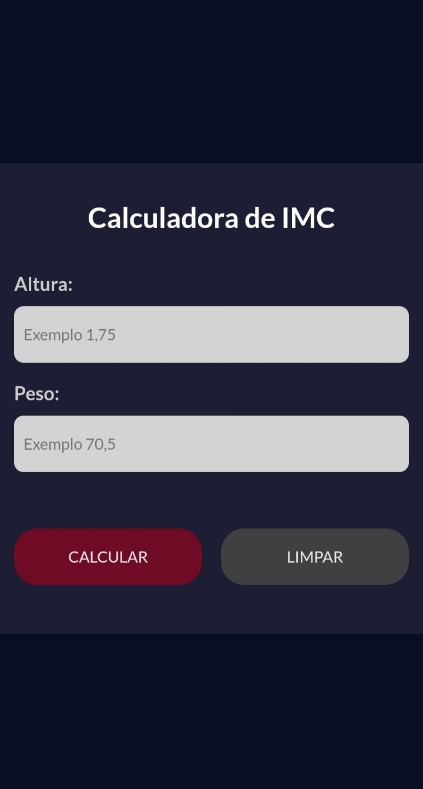
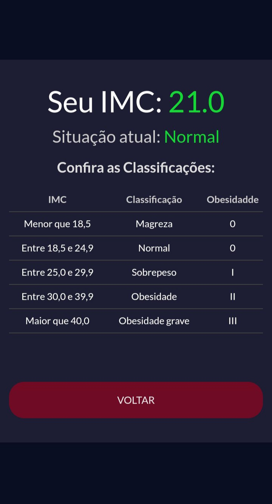

<h1 align="center"> Calculadora de IMC </h1>

A calculadora foi desenvolvida ano passado (2022) assistindo a um vídeo no YouTube. Programei utilizando um computador e o celular (este na maior parte do tempo),fiz com o intuito de treinar minhas habilidades, aprender novas funcionalidades do JavaScript e conseguir reutilizar o código para futuros projetos 🚀⚡.  

  <a href="#-tecnologias">Tecnologias</a>&nbsp;&nbsp;&nbsp;|&nbsp;&nbsp;&nbsp;
  <a href="#-projeto">Projeto</a>&nbsp;&nbsp;&nbsp;|&nbsp;&nbsp;&nbsp;
  <a href="#memo-licença">Licença</a>

  

 

  

  

 

## ⚙️👨‍💻 Tecnologias

Esse projeto foi desenvolvido com as seguintes tecnologias:

- HTML e CSS
- JavaScript
- Git e Github

## 💻 Projeto

O projeto pede para o usuário sua altura e peso (utilize vírgula), com isso é só clicar em calcular para ser realizado o cálculo do IMC ("IMC = peso / (altura x altura)"). Finalmente será exibido a tabela com seu Índice de Massa Corpórea. 

- [Acesse o projeto finalizado, online ☁️](https://joaoalisonti.github.io/IMC-Calc/)

---
 
## :memo: Licença

Esse projeto está sob a licença MIT.

---

<strong>2023</strong>